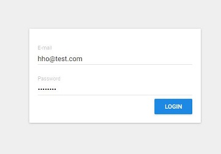
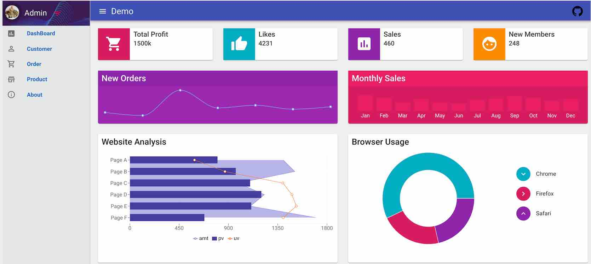
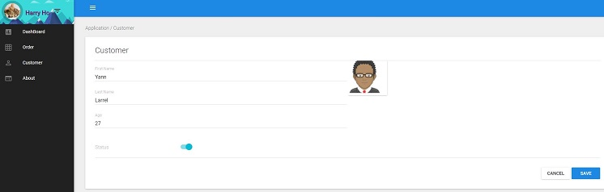
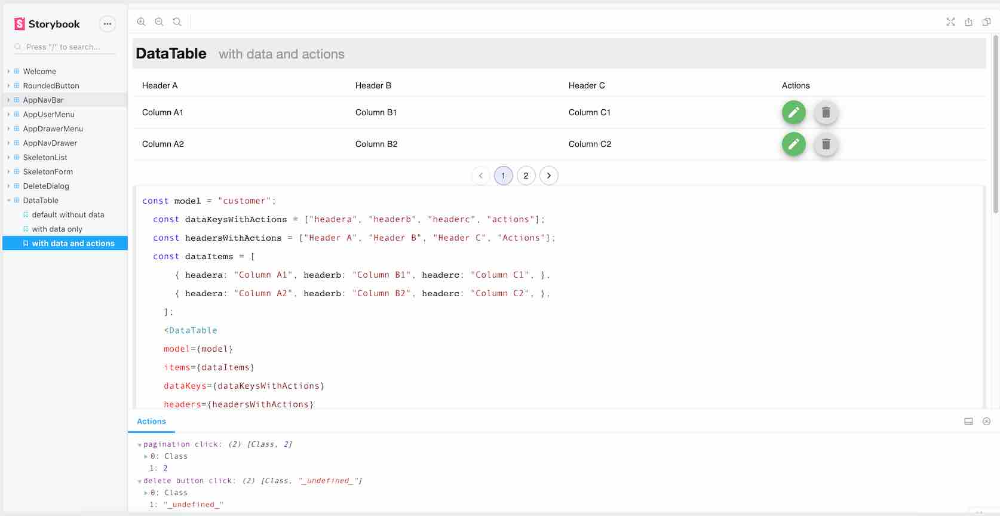

### Screenshots






<!--  -->

----

Storybook
  



## Build Setup

```bash
# Clone project
git clone https://github.com/harryho/react-crm.git


# install the packages with npm
cd react-crm
npm install

# start the server with hot reload at localhost:4000
npm start
# or yarn
yarn start

# Storybook
## Start storybook
npm run storybook
## Build storybook
npm run build-storybook

## build for production
npm run build

```
